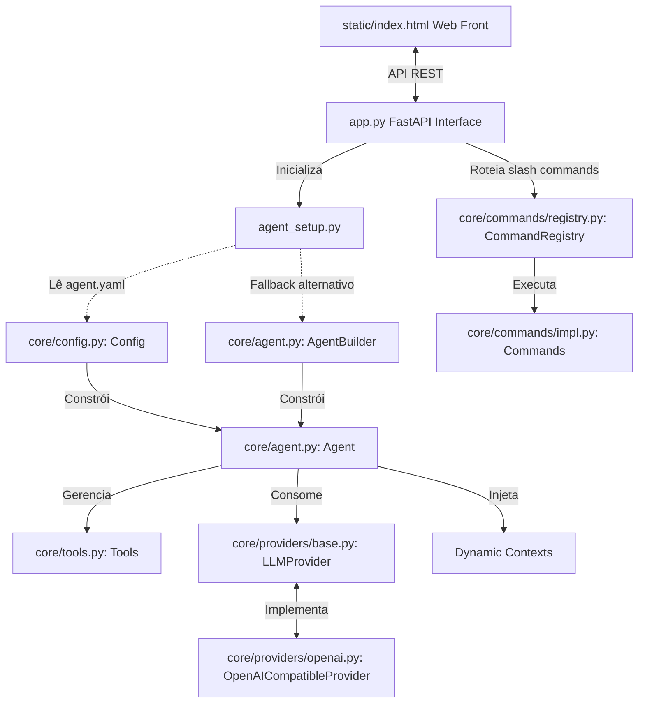

# 🤖 MyAgent — Plataforma de Agente de IA com Interface Web

Bem-vindo ao MyAgent! Este é um projeto modular e extensível para a criação de agentes de inteligência artificial autônomos, utilizando uma interface web moderna (Web UI) de alto padrão construída com FastAPI e Uvicorn.

O agente pode ser configurado de forma estática através de um arquivo agent.yaml na raiz do projeto, ou dinamicamente utilizando código Python. O processador de configurações aceita definições de prompt de sistema, nome do modelo e conexões com APIs compatíveis com a do OpenAI.

---

## 🏛️ Arquitetura do Sistema

O projeto adota uma estrutura em camadas para desacoplar a lógica do agente, as ferramentas disponíveis, o provedor de LLM e a interface de usuário:



### Principais Conceitos:
1. Agent (core/agent.py): Controla o estado da conversa (messages), executa o loop de chat (chat) e resolve chamadas de ferramentas de forma recursiva até que o modelo retorne uma resposta textual final.
2. Tools (core/tools.py): Analisa as assinaturas de funções Python em tempo de execução usando tipagem estática e comentários (Docstrings) para gerar automaticamente esquemas JSON compatíveis com a especificação de Function Calling.
3. Providers (core/providers/base.py): Abstrai a comunicação HTTP com os LLMs. A implementação padrão (core/providers/openai.py) suporta servidores compatíveis com o OpenAI.
4. Commands (core/commands/base.py): Mapeia ações disparadas pelo prefixo / (slash commands). Centralizado em core/commands/registry.py, o sistema executa os comandos na Web UI.
5. Config (core/config.py): Lê o arquivo de configuração agent.yaml e utiliza o AgentBuilder para construir a instância do Agent correspondente.

---

## 📂 Estrutura de Pastas e Arquivos

Aqui está o mapeamento dos componentes fundamentais do projeto:

* app.py: Servidor FastAPI com rotas REST e montagem dos arquivos estáticos para o frontend.
* agent_setup.py: Local centralizado para instanciar o agente, definir o prompt de sistema, injetar variáveis de contexto e registrar ferramentas de domínio.
* agent.yaml: Arquivo de configuração YAML que define o modelo, o prompt do sistema e os parâmetros do provedor LLM.
* core/: Núcleo do sistema de agente.
  * core/agent.py: Implementação do Agent e do AgentBuilder.
  * core/config.py: Classe Config para carregamento do arquivo agent.yaml.
  * core/tools.py: Mecanismo de mapeamento automático de funções Python para schemas JSON e execução de callbacks.
  * core/providers/: Abstrações de LLM (OpenAI-compatible, etc.).
  * core/commands/: Infraestrutura e implementações dos comandos /.
* static/: Arquivos estáticos do frontend da interface Web (HTML, CSS customizado e JavaScript).
* exports/: Pasta onde são guardados os históricos de conversas exportados.
* workspace/: Pasta de trabalho do agente. Ferramentas de leitura e gravação operam de forma isolada e segura dentro deste diretório.

---

## ⚙️ Configuração (agent.yaml)

O arquivo agent.yaml deve estar localizado no diretório raiz do projeto. Exemplo de configuração padrão:

```yaml
# Configurações do MyAgent
model: "qwen/qwen3-vl-4b"
system_prompt: "You are a helpful assistant."

provider:
  name: "openai"
  base_url: "http://localhost:1234/v1"
  base_api_url: "http://localhost:1234/api/v1"
  api_key: "NO_API_KEY"
```

---

## 🚀 Instalação e Execução

### Pré-requisitos
* Python >= 3.14 (especificado no arquivo pyproject.toml).
* Recomendado: Gerenciador de pacotes uv para instalação ágil de dependências.
* Um provedor de modelo local rodando na porta 1234 (ex: LM Studio configurado com o modelo qwen/qwen3-vl-4b ou similar).

### 1. Clonar e Instalar Dependências
Para instalar as dependências utilizando o uv:
```bash
# Sincroniza e cria o ambiente virtual
uv sync
```
Caso prefira utilizar o pip padrão:
```bash
pip install -r pyproject.toml
```

### 2. Rodar a Interface Web
Para iniciar o servidor web local com FastAPI (Uvicorn):
```bash
uv run app.py
```
O servidor estará ativo em http://localhost:8000. Abra esse endereço no seu navegador para interagir com a interface web.

---

## 🛠️ Como Estender o Agente

A modularidade do MyAgent facilita a expansão de suas funcionalidades. Abaixo, veja como adicionar novas capacidades.

### 1. Adicionando uma Nova Ferramenta (Tool)
Para disponibilizar uma nova função para o agente, basta declará-la e decorá-la com @agent.tool dentro de agent_setup.py. Use tipagens explícitas (Annotated) e uma docstring descritiva.

```python
from typing import Annotated

# Exemplo de nova ferramenta no agent_setup.py
@agent.tool
def get_weather(
    cidade: Annotated[str, "O nome da cidade para buscar a previsão"],
    unidade: Annotated[str, "A unidade de temperatura ('celsius' ou 'fahrenheit')"] = "celsius"
) -> dict:
    """Busca a previsão do tempo para uma cidade específica."""
    # Sua lógica aqui...
    return {"temperatura": "22", "condicao": "Ensolarado", "unidade": unidade}
```
O sistema mapeia automaticamente a assinatura acima para o formato JSON Schema strict que será enviado ao LLM.

### 2. Adicionando um Novo Comando Slash (/)
Todos os comandos herdam da classe abstrata Command localizada em core/commands/base.py.

Para criar um comando /date:
1. Crie a classe em core/commands/impl.py:
```python
class DateCommand(Command):
    @property
    def name(self) -> str:
        return "/date"

    @property
    def description(self) -> str:
        return "Show current system date and time"

    def execute(self, agent: Any, console: Console, args: list[str]) -> CommandAction:
        now = datetime.now().strftime("%Y-%m-%d %H:%M:%S")
        console.print(f"Current Date/Time: {now}")
        return CommandAction.CONTINUE
```
2. Registre-o no arquivo core/commands/registry.py:
```python
from core.commands.impl import DateCommand
# ...
CommandRegistry.register(DateCommand())
```

### 3. Injetando Variáveis de Contexto Dinâmico
Você pode expor estados locais ou variáveis globais para o prompt do sistema a cada mensagem enviada, usando o decorador @agent.context em agent_setup.py:

```python
@agent.context
def battery_status() -> str:
    """Verifica e retorna o status de bateria da máquina atual."""
    return "Battery level: 85% (Charging)"
```

---

## 📡 Endpoints da API Web

O backend em app.py expõe os seguintes serviços Restful:

| Endpoint | Método | Descrição |
| :--- | :--- | :--- |
| / | GET | Serve o arquivo HTML principal da interface Web. |
| /api/chat | POST | Processa mensagens enviadas pelo usuário ou executa comandos da CLI de forma simulada. |
| /api/files | GET | Lista todos os arquivos existentes dentro da pasta workspace/ (incluindo caminhos e tamanhos). |
| /api/tools | GET | Retorna o esquema completo de metadados das ferramentas ativas no agente. |
| /api/status | GET | Retorna a configuração global do agente (modelo ativo, prompt de sistema e provedor). |
| /api/commands | GET | Lista de todos os comandos Slash registrados no sistema. |

---

## 🎨 Interface Web Premium

A interface web foi desenvolvida com foco em usabilidade e design premium:
- Painel Lateral Esquerdo (Sidebar): Mostra em tempo real as configurações do modelo e provedor, a lista detalhada das ferramentas registradas (com descrição de argumentos) e a listagem interativa de arquivos do workspace/.
- Feed de Chat Central: Permite troca de mensagens limpa, suporte a formatação markdown renderizada via JavaScript (marked.js), destaque de trechos de código e notificações visuais sobre chamadas de ferramentas e estados de "Pensando" (Thinking).
- Auto-complete de Comandos: Ao digitar / na caixa de entrada, a interface sugere dinamicamente os comandos registrados no backend.
- Exportação Simples: Ao rodar /export json ou /export txt no chat da web, um link de download direto é gerado na própria conversa para facilitar o acesso.
